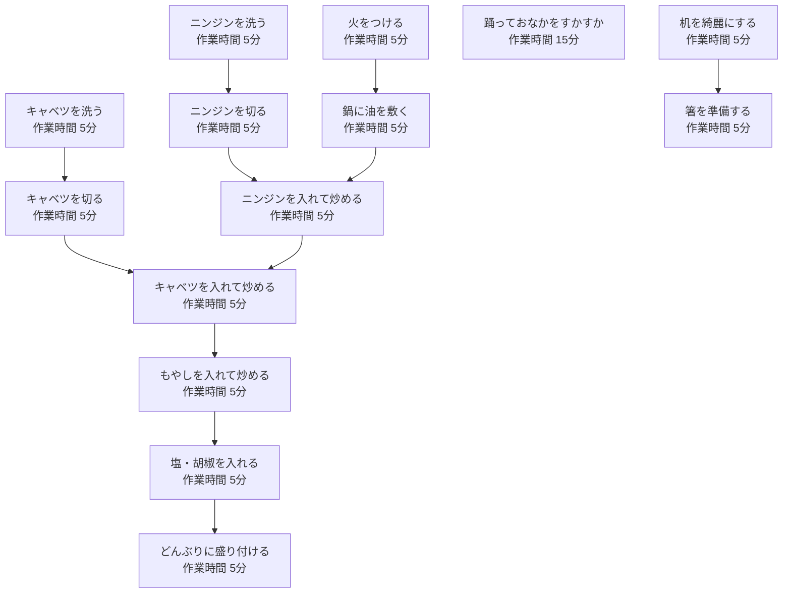

```mermaid
flowchart TD

    id1-1["ニンジンを洗う
        作業時間 5分"]
    id1-2["キャベツを洗う
        作業時間 5分"]
    id1-3["ニンジンを切る
        作業時間 5分"]
    id1-4["キャベツを切る
        作業時間 5分"]

    id2-1["火をつける
        作業時間 5分"]
    id2-2["鍋に油を敷く
        作業時間 5分"]
    id2-3["ニンジンを入れて炒める
        作業時間 5分"]
    id2-4["キャベツを入れて炒める
        作業時間 5分"]
    id2-5["もやしを入れて炒める
        作業時間 5分"]
    id2-6["塩・胡椒を入れる
        作業時間 5分"]
    id2-7["どんぶりに盛り付ける
        作業時間 5分"]

    id3-1["踊っておなかをすかすか
        作業時間 15分"]
    id3-2["机を綺麗にする
        作業時間 5分"]
    id3-3["箸を準備する
        作業時間 5分"]

    id1-1 --> id1-3
    id1-2 --> id1-4

    id1-3 --> id2-3
    id1-4 --> id2-4

    id2-1 --> id2-2 --> id2-3 --> id2-4 --> id2-5 --> id2-6 --> id2-7

    id3-1
    id3-2 --> id3-3


```