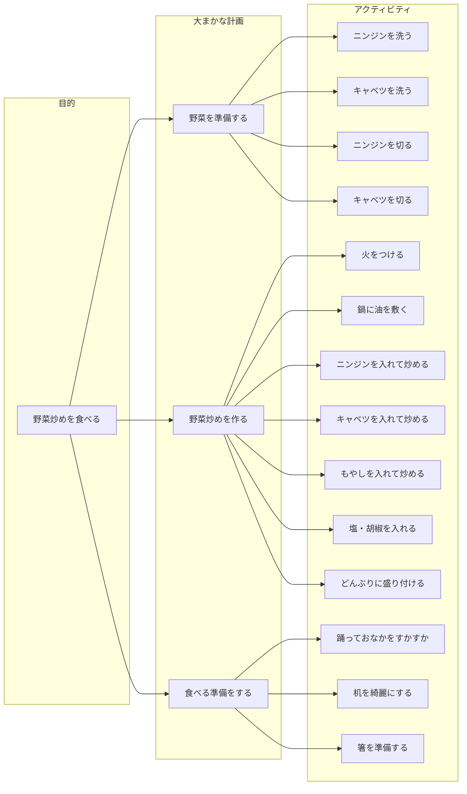

```mermaid
flowchart LR
    goal["野菜炒めを食べる"]

    id1["野菜を準備する"]
    id2["野菜炒めを作る"]
    id3["食べる準備をする"]

    id1-1["ニンジンを洗う"]
    id1-2["キャベツを洗う"]
    id1-3["ニンジンを切る"]
    id1-4["キャベツを切る"]

    id2-1["火をつける"]
    id2-2["鍋に油を敷く"]
    id2-3["ニンジンを入れて炒める"]
    id2-4["キャベツを入れて炒める"]
    id2-5["もやしを入れて炒める"]
    id2-6["塩・胡椒を入れる"]
    id2-7["どんぶりに盛り付ける"]

    id3-1["踊っておなかをすかすか"]
    id3-2["机を綺麗にする"]
    id3-3["箸を準備する"]

    
    subgraph "目的"
        goal
    end

    goal --> id1
    goal --> id2
    goal --> id3

    subgraph "大まかな計画"
        id1
        id2
        id3
    end

    subgraph "アクティビティ"
        id1 --> id1-1
        id1 --> id1-2
        id1 --> id1-3
        id1 --> id1-4

        id2 --> id2-1
        id2 --> id2-2
        id2 --> id2-3
        id2 --> id2-4
        id2 --> id2-5
        id2 --> id2-6
        id2 --> id2-7

        id3 --> id3-1
        id3 --> id3-2
        id3 --> id3-3
    end
```