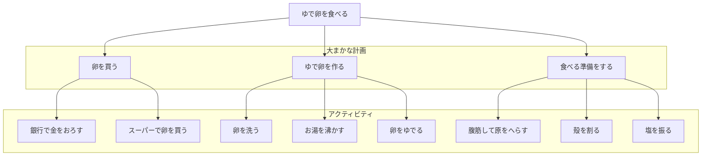

```mermaid
flowchart TD
    goal["ゆで卵を食べる"]
    id1["卵を買う"]
    id2["ゆで卵を作る"]
    id3["食べる準備をする"]
    id1-1["銀行で金をおろす"]
    id1-2["スーパーで卵を買う"]
    id2-1["卵を洗う"]
    id2-2["お湯を沸かす"]
    id2-3["卵をゆでる"]
    id3-1["腹筋して原をへらす"]
    id3-2["殻を割る"]
    id3-3["塩を振る"]

    goal --> id1
    goal --> id2
    goal --> id3

    subgraph "大まかな計画"
        id1
        id2
        id3
    end
    subgraph "アクティビティ"
        id1 --> id1-1
        id1 --> id1-2
        id2 --> id2-1
        id2 --> id2-2
        id2 --> id2-3
        id3 --> id3-1
        id3 --> id3-2
        id3 --> id3-3
    end


```