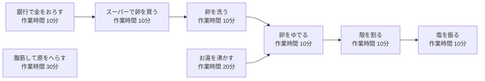

```mermaid
flowchart LR
    id1-1["銀行で金をおろす
        作業時間 10分"]
    id1-2["スーパーで卵を買う
        作業時間 10分"]
    id1-3["卵を洗う
        作業時間 10分"]

    id2-1["お湯を沸かす
        作業時間 20分"]
    id2-2["卵をゆでる
        作業時間 10分"]
    id2-3["殻を割る
        作業時間 10分"]
    id2-4["塩を振る
        作業時間 10分"]

    id3-1["腹筋して原をへらす
        作業時間 30分"]


    id1-1 --> id1-2
    id1-2 --> id1-3

    id1-3 --> id2-2

    id2-1 --> id2-2
    id2-2 --> id2-3
    id2-3 --> id2-4

    id3-1
```